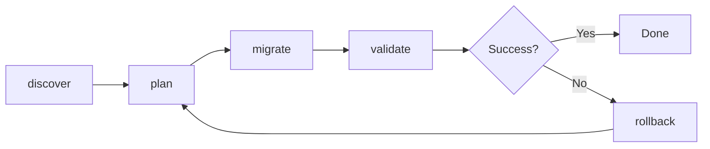

# Command Reference

bb2gh provides a Terraform-inspired workflow with six main commands.

## Workflow Overview



## Commands

| Command | Description |
|---------|-------------|
| [discover](discover.md) | Scan Bitbucket workspace and create inventory |
| [plan](plan.md) | Generate migration plan from inventory |
| [migrate](migrate.md) | Execute migration according to plan |
| [validate](validate.md) | Verify migration completeness |
| [status](status.md) | Check migration progress |
| [rollback](rollback.md) | Revert a failed migration |

## Global Options

These options apply to all commands:

```
--config FILE      Path to config file
--log-level LEVEL  Set logging level (DEBUG, INFO, WARNING, ERROR)
--quiet            Suppress non-essential output
--verbose          Enable verbose output
--help             Show help message
```

## Exit Codes

| Code | Meaning |
|------|---------|
| 0 | Success |
| 1 | General error |
| 2 | Invalid arguments |
| 3 | Authentication error |
| 4 | Network error |
| 5 | Validation failed |
