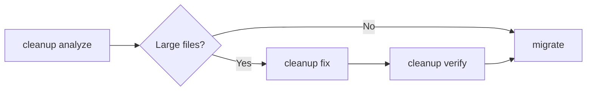

# cleanup

Remove or convert oversized files from repository history before migration to GitHub.

GitHub enforces a strict 100 MiB per-file push limit. Repositories containing files above this threshold will fail during `migrate`. The `cleanup` command detects these files and rewrites git history to remove or convert them.

## Workflow



## Subcommands

| Subcommand | Description |
|------------|-------------|
| [analyze](#analyze) | Scan repository history for oversized files |
| [fix](#fix) | Remove or convert files using a cleanup engine |
| [verify](#verify) | Confirm no oversized blobs remain |

## analyze

Scan all commits, branches, and tags for files exceeding the size threshold.

```bash
bb2gh cleanup analyze REPO_SLUG [OPTIONS]
```

### Options

| Option | Description | Default |
|--------|-------------|---------|
| `--threshold` | Size threshold (e.g. `100MB`, `5GB`) | `100MB` |
| `--output FILE` | Save report to a JSON file | — |

### Example

```bash
bb2gh cleanup analyze backend-api

# Large Files in backend-api
# ┌──────────────────────┬──────────┬─────────┬──────────┐
# │ Path                 │     Size │ Commit  │ In HEAD? │
# ├──────────────────────┼──────────┼─────────┼──────────┤
# │ data/dump.sql        │ 245.3 MB │ a1b2c3d │ No       │
# │ vendor/sdk.jar       │ 112.0 MB │ e4f5a6b │ Yes      │
# └──────────────────────┴──────────┴─────────┴──────────┘
#
# Repository: backend-api
# Commits scanned: 4,521
# Estimated savings: 357.3 MB
```

## fix

Remove oversized files from history or convert them to Git LFS pointers.

> **Warning**: This command rewrites git history. A mirror backup is created automatically before any destructive operation. By default, `fix` runs in **dry-run mode** — use `--confirm` to execute.

```bash
bb2gh cleanup fix REPO_SLUG [OPTIONS]
```

### Options

| Option | Description | Default |
|--------|-------------|---------|
| `--strategy` | `remove` (delete from history) or `lfs` (convert to LFS pointers) | `remove` |
| `--engine` | `auto`, `filter-repo`, or `bfg` | `auto` |
| `--pattern` | File patterns to target (repeatable, e.g. `--pattern "*.jar" --pattern "*.sql"`) | — |
| `--above` | Size threshold for files to clean | `100MB` |
| `--confirm` | Execute the cleanup (without this flag, runs as dry-run) | `false` |
| `--backup-dir` | Custom directory for mirror backup | — |

### Strategies

| Strategy | When to use |
|----------|-------------|
| `remove` | Files no longer needed (old dumps, binaries checked in by mistake) |
| `lfs` | Files still needed in the working tree (design assets, compiled dependencies) |

### Examples

```bash
# Dry-run: preview what would be removed
bb2gh cleanup fix backend-api

# Remove all files over 100MB from history
bb2gh cleanup fix backend-api --confirm

# Convert JAR files to LFS pointers
bb2gh cleanup fix backend-api --strategy lfs --pattern "*.jar" --confirm

# Remove specific patterns from history
bb2gh cleanup fix backend-api --pattern "*.sql" --pattern "data/*" --confirm

# Use a custom backup location
bb2gh cleanup fix backend-api --confirm --backup-dir /mnt/backups
```

## verify

Confirm that cleanup was successful and no oversized blobs remain.

```bash
bb2gh cleanup verify REPO_SLUG [OPTIONS]
```

### Options

| Option | Description | Default |
|--------|-------------|---------|
| `--threshold` | Size threshold to check against | `100MB` |

### Example

```bash
bb2gh cleanup verify backend-api
# Verification passed!
# Branches: 12/12
# Tags: 45/45
```

## Safety

- **Mirror backup**: A full mirror clone is created before any history rewrite. If anything goes wrong, the backup preserves the original state.
- **Integrity check**: `git fsck` runs on the backup to ensure it is valid before proceeding.
- **Dry-run by default**: The `fix` command previews changes unless `--confirm` is passed.
- **Pre-flight checks**: Disk space (3x repo size), LFS availability (for `lfs` strategy), and bare repository validation are verified before execution.

## Cleanup Engines

| Engine | Status | Capabilities |
|--------|--------|-------------|
| `filter-repo` | Available | Remove by size, remove by pattern |
| `bfg` | Stub (future) | Remove by size only |

Engine auto-detection picks the first available engine in preference order. Use `--engine` to override.

## Integration with migrate

When cleanup is configured in a migration plan, it runs automatically as part of the `migrate` command — after cloning but before pushing to GitHub. See [Configuration](../getting-started/configuration.md) for plan-level cleanup settings.
